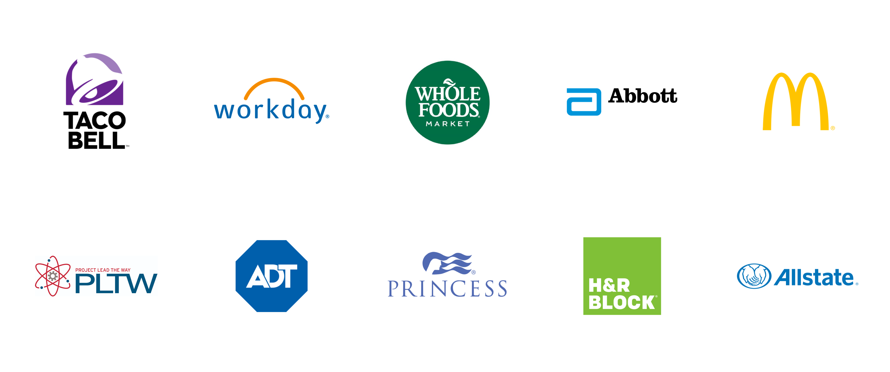
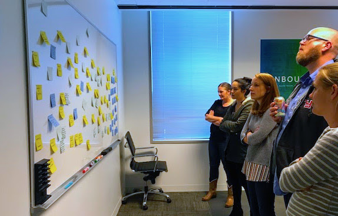
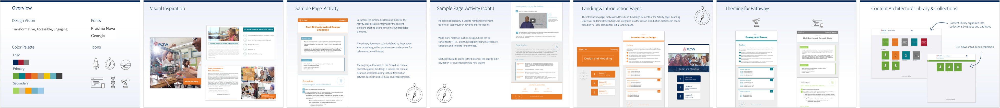
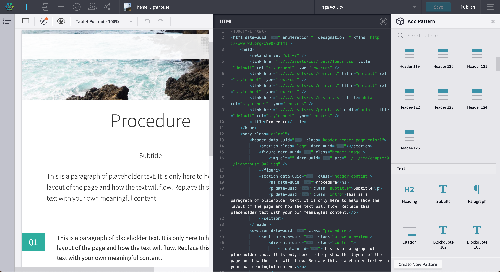
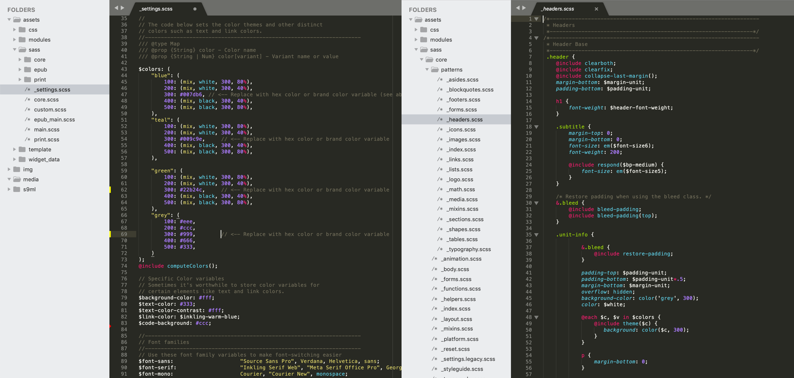
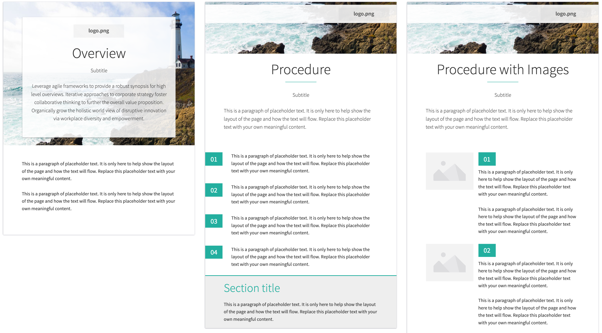
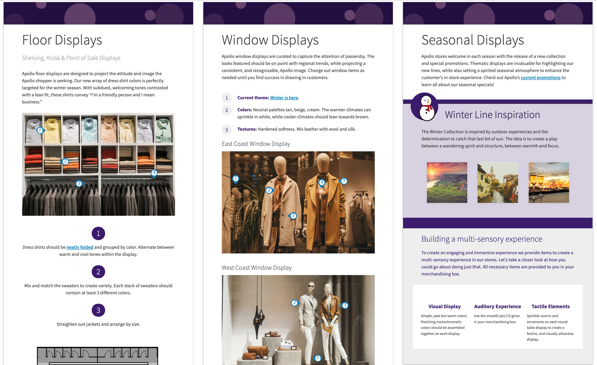
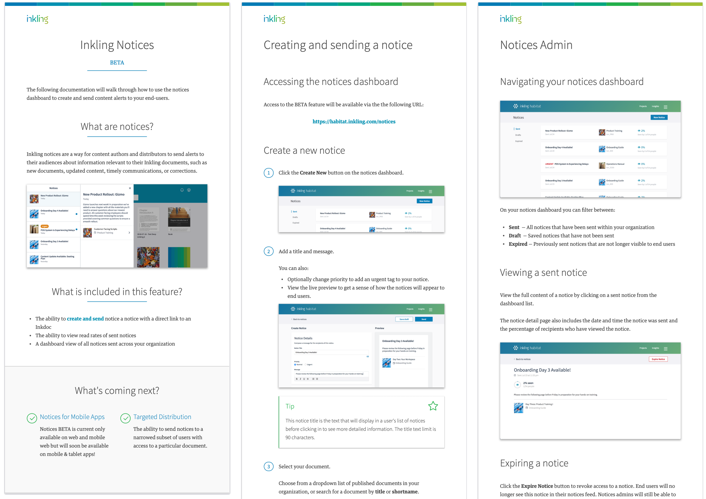

I've worked with some of the world's leading brands to design their digital content and develop customized authoring templates for their training and reference materials. Much of this work is under NDA, but please reach out if you'd like to know more about a particular project or learn more about the process below.

## Discover

All projects begin with understanding the core goals and key problems to solve, so we begin by working directly with the every customer team to identify the needs and pain points of the end users, authors, and business owners.

Through this collaboration we develop a complete picture of the learners' work environment, the program of content and the development process, and the aspirational objectives of the content teams, and we align on a path forward.

## Design

The design phase is all about exploring ways to solve the needs defined during discovery. These goals range from reimagining the content architecture for a mobile environment, to designing a more engaging and interactive experience, or bringing visual delight to the learning materials. 

For the authors, we also begin to thoroughly map all existing content into reusable patterns to make the content creation process simple, consistent, and scaleable.

The final output is a design brief with a template proposal that takes into account the customer's core needs.

## Develop

Templates are HTML, CSS, and JavaScript under the hood, meaning the content can be accessed anywhere on any device. Our development process is based primarily using <a href="https://www.sass-lang.com" target="_blank" alt="SASS Documentation"><b>SASS</b></a>, which enables us to architect our pattern styles using functions, partials organization, and variables. The goal is to create a robust, thoroughly tested, and scaleable design system, where we can easily update themes across every page of content by modifying a single line of code. 

What we build out in code is surfaced to authors as a fully drag, drop, and inline-edit experience, with fully branded patterns curated to their specific content program. Depending on the needs of the team, we can implement strict rails, or enable a full suite of configuration options custom to each pattern. 

 

## Test, Iterate, Launch

The most successful launches are preceded by a pilot phase where we work with content creators to test materials with a group of users and incorporate learnings and feedback. This lets us go into full scale distribution with confidence that we've created the best learning experience. 

