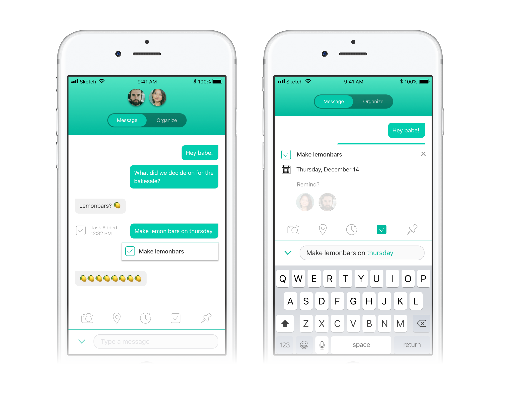
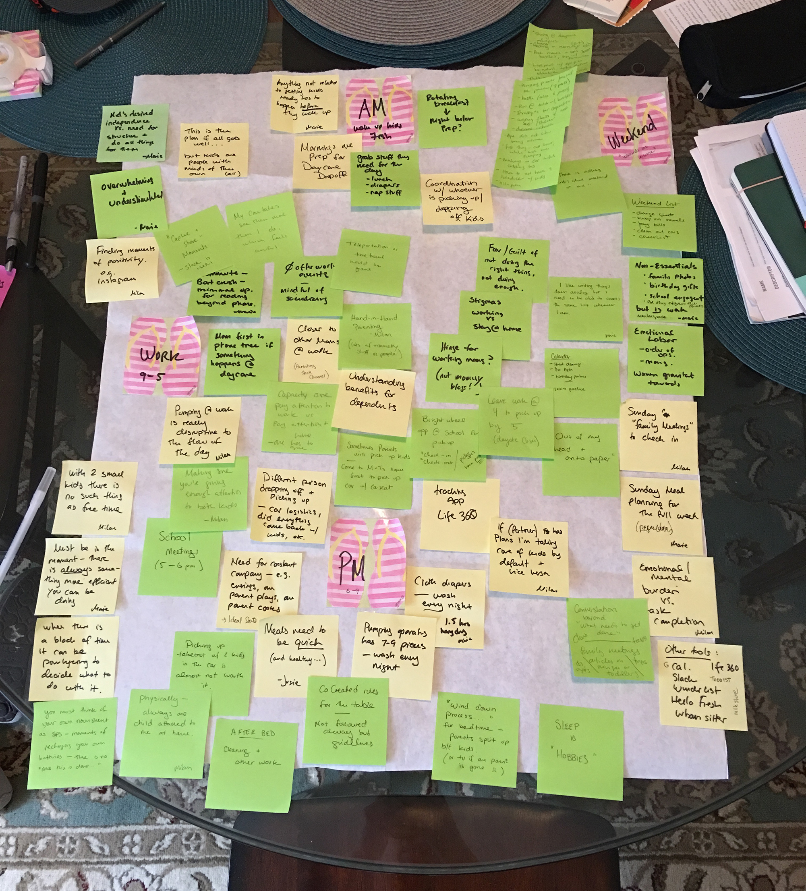
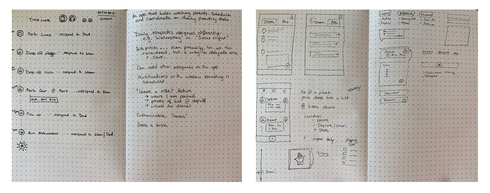
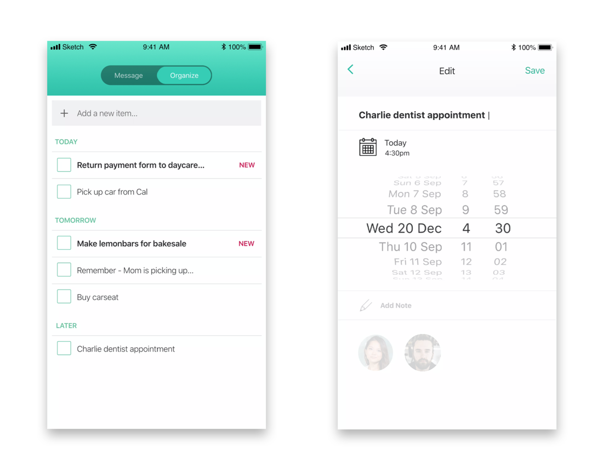
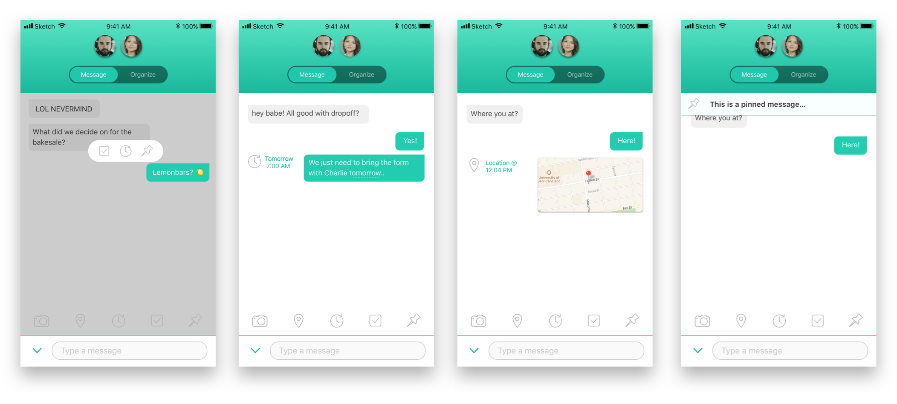
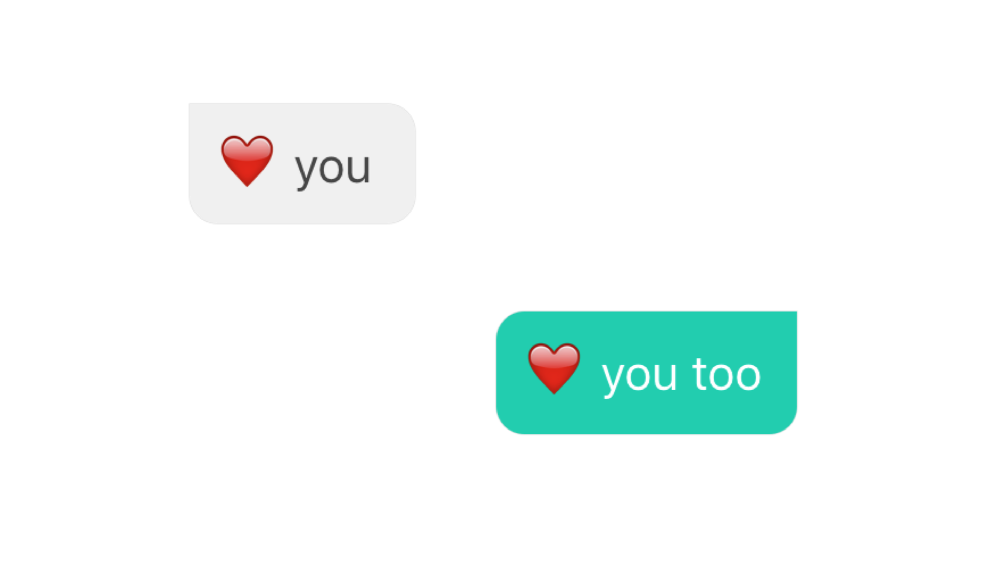

<a href="#final-p2" class="btn-jump">Jump to final designs</a>

<!-- 
Coming soon
 -->

The following was my final project for a UX boot-camp, and something I still hope to make real one day... :).

## Research

To come up with a product idea I began with the persona I was trying to help. At the time, quite a few of of my friends and coworkers had become first-time parents, and I wanted to tackle a problem that would help the chaotic lives of full-time working moms. I scheduled as many interview sessions as a could to try to get a full picture of what a daily routine was like and what challenges had surfaced since having kids.

Over the course of these conversations, some common themes emerged.

1. **Every moment of the day is scheduled (“There’s no such thing as free time”)**
    Between school commuting, meal planning, play dates, cleaning, diaper changing, doctors' appointments, not to mention and 9-to-5 workday, days are packed and highly organized.

2. **Responsibilities are handed off between parents from day to day**
   One parent might pick up the kid from school one day an the other drop them off the next. If there's a form that needs to be signed and returned that hand-off has to happen.

3. **Managing order of operations is essential to getting things done**
   If the dishwasher isn't run the night before, Mom won't have her pumping equipment for work the next morning.

4. **You’re caring for a small, increasingly autonomous human**
   So nothing ever "goes as planned."

Pervading all of this, though, was perhaps the most important insight: **How does this work when you take the emotions of a relationship into account?**

This was a enormous problem to tackle, but one that felt very worthwhile! (For a deeper look at the mental burden of the managers of the household check out the fantastic web comic ["You Should've Asked"](https://english.emmaclit.com/2017/05/20/you-shouldve-asked/).)

## Some early trials and lessons learned

I was excited by my first concept — what if you had an app that essentially created a timeline of your day and kept track of your progress and completions in real time? A parent could enter their and their partners' schedules, and have any missed or uncompleted items automatically be added to a future task list. They could also leave notes for each other at each "event."

Once I talked to parents, I immediately threw out this idea. The amount of upfront work required to create the daily schedule completely invalidated its potential usefulness. Additionally, flexibility was essential when whole days could be thrown off by a sick kid or a last-minute work emergency. Having a rigid timeline that pinged you about overdue items if you needed to shuffle your day would surely lead to even more frustration. 

However, the whole issue of heavy setup work was a valuable insight, and I shifted thinking about the following:
  - How could the "organization" aspect of parenting tasks take place naturally in the course of existing behavior
  - Could a tool smartly predict tasks and do some of that work for them?
  - How could tasks be shared without one parent telling the other one what to do?

I began exploring integrating a shared "todo" list into the flow of general texting and communication.

<h2 id="final-p2"> Final designs</h2>

### Goals

1. A way to easily track and share everything that needs to get done
2. Relief from some of the mental and emotional burden of managing a shared household
3. Less time organizing and more quality time spent with the family

### Solution

#### Chat

The breakthrough for this solution came with the idea of integrating task creation into the flow of conversation. The young working parents I interviewed were constantly connected and communicating through messaging apps, combined with other scheduling tools in an attempt to stay coordinated. Thus default view of the my app became a chat interface from which parents could do all their planning without having to switch views or use another tool. 

**Features:**
  - Create todos directly in the flow of your chat
  - Predictive auto-fill based on recognizing keywords such as _Tomorrow_, _Thursday_, or _June 12_.
  - Modify tasks before saving (change title or set reminders)
  - Saved items are visible and expandable to both parties in the chat

<!-- `vimeo: https://vimeo.com/354446411` -->

#### Organize

The second pillar of the app is the organization side, giving partners access to a shared task list.

**Features:**
  - From here they can organize tasks or add new items
  - Order prioritizes today and tomorrow and everything else is "later" until it becomes urgent
  - Task list is visible to both parents to help them see and overview of what needs to get done

#### Get Reminders

When items are due, reminders appear in the flow of the messaging interface. These reminders come from a cute chat bot rather than the other parent, hopefully preventing the household manager from feeling like they are nagging!

**Features:**
  - Reminders appear only for whomever was set to be notified to prevent unnecessary alerts
  - Reminders provide the option to view the task in the context if its creating, scrolling you back in the chat to see the surrounding conversation.
  - Once completed, both parents can see the item is taken care of. Now both parents have peace of mind without needing to follow up.

#### Stay coordinated:

As the app would ideal become the default way for parents to communicate, I wanted to add additional features to help them stay coordinated.

**Features:**
  - Quick actions (long press) to create tasks or set reminders directly from texts
  - Ability to easily share locations in order to find each other or let the other parent know where the car is parked
  - Option to pin important messages at the top of the screen

### And Overall... 

Everything hopefully added up to a way for partners to stay on the same page without needing to expend extra effort, feel like they were nagging the other parent, and focus on what matters most.

