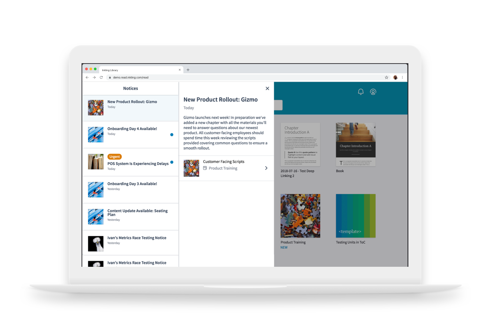
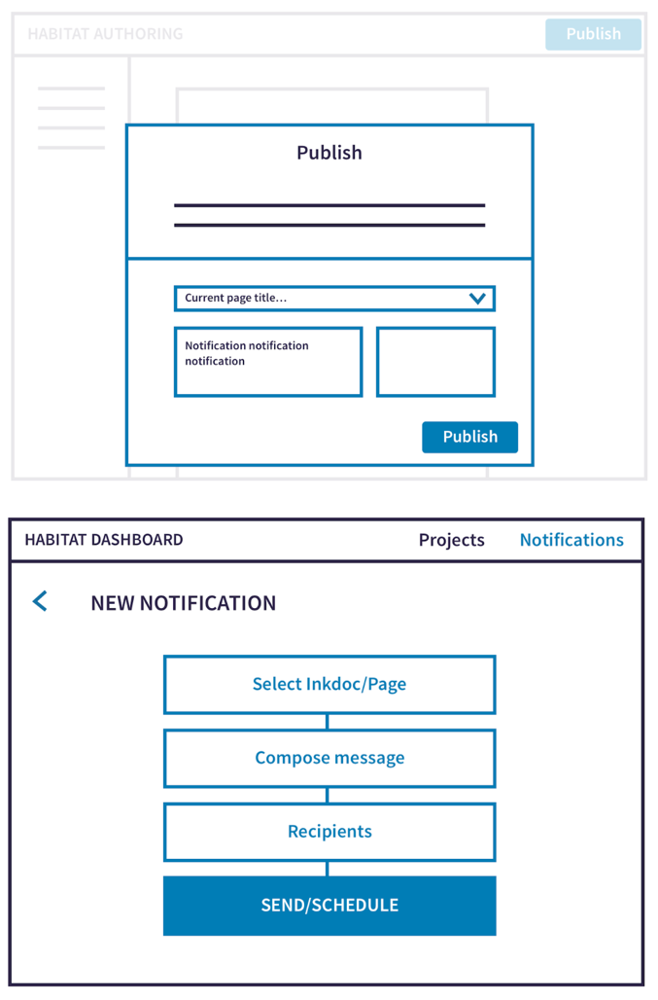
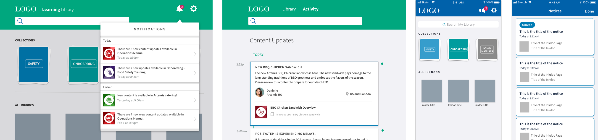
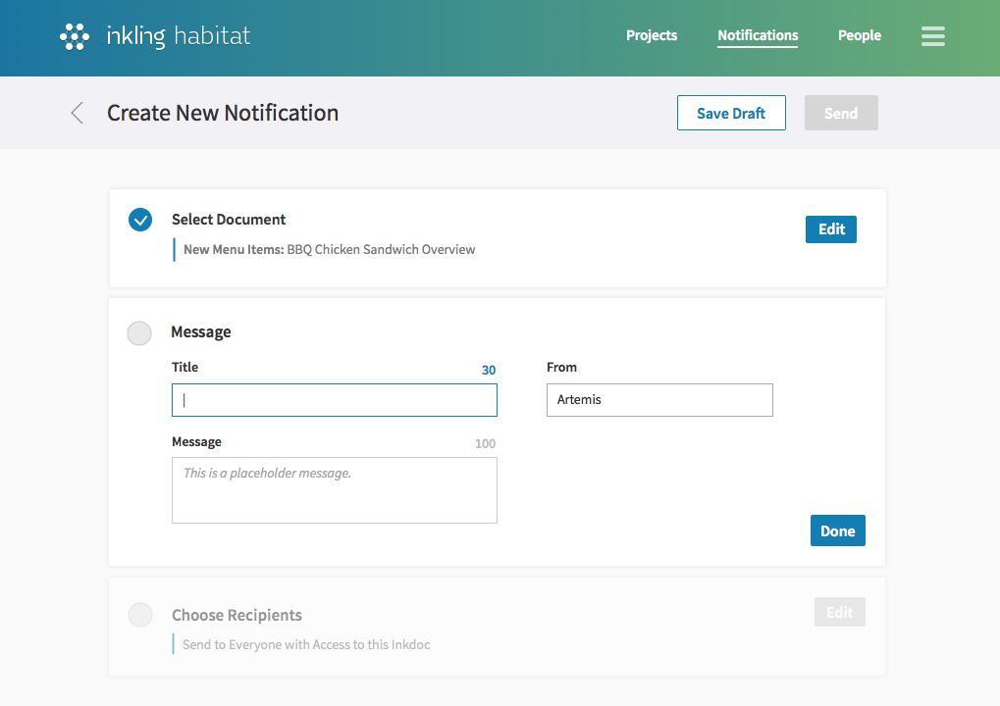
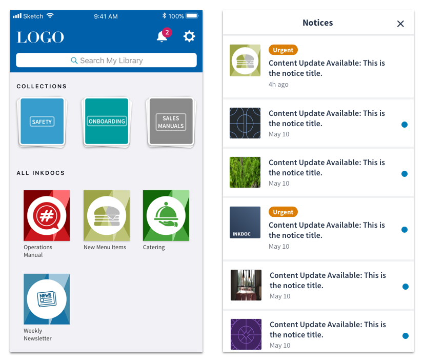
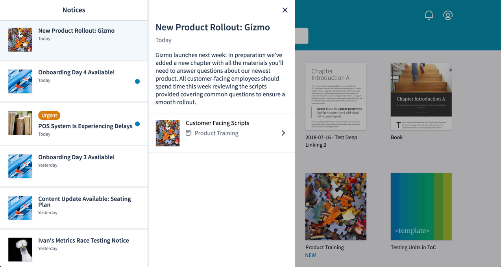
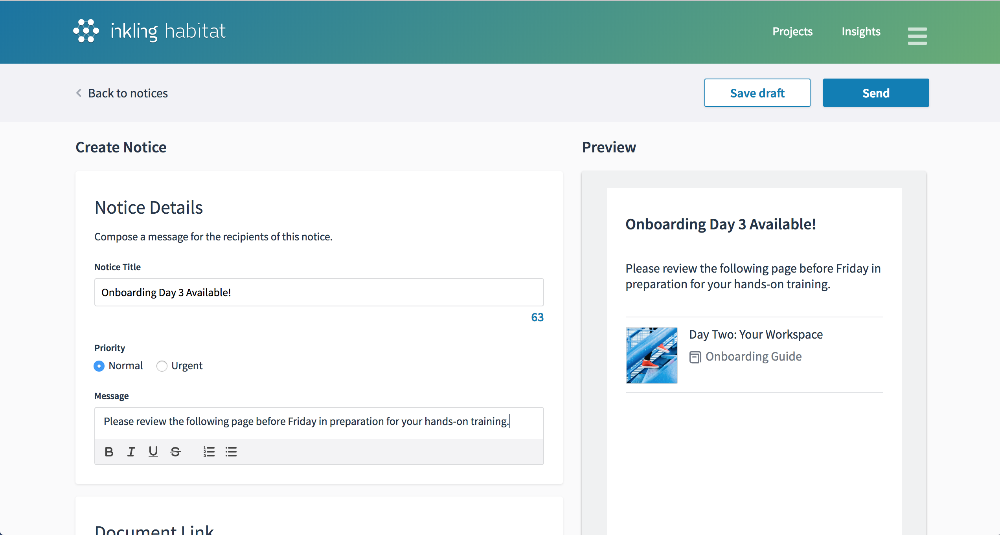
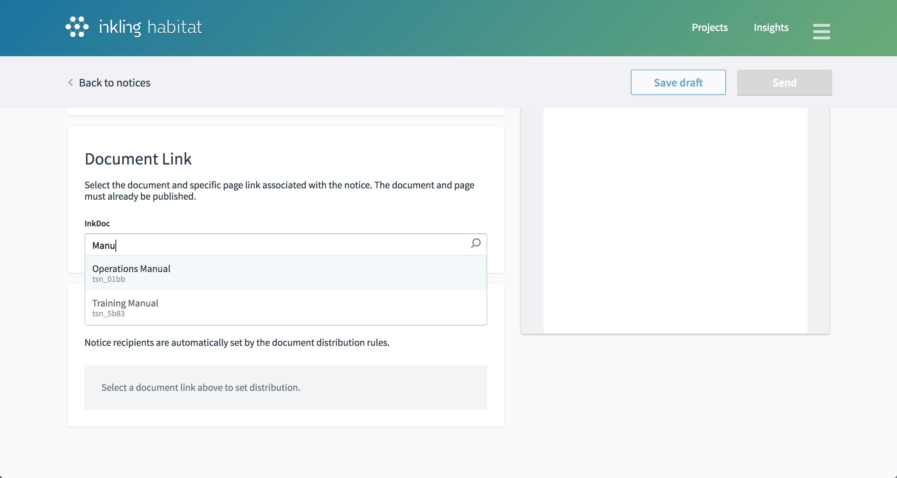

<!-- <section class="project-nav">

  - [Overview](#overview)
  - [Problem Statement](#problem-statement)
  - [Discovery & Ideation](#discovery--ideation)
  - [User Testing](#user-testing)
  - [Final designs](#final-designs)
  - [Feedback & Next Steps](#feedback--next-steps)

</section> -->

<a href="#final-p3" class="btn-jump">Jump to final designs</a>

## Background

The Inkling Knowledge platform enables content creators to author and distribute digital documents to their users, including the ability to push out instant updates to published content as necessary.

At the time, the product provided no way for users to easily understand what content had changed or if there was new content available for them to access. Many of our customers were implementing workarounds by sending summaries of changes via email, creating a confusing and disjointed experience for their users, and reducing their engagement with the Inkling platform by requiring them to view updates outside of the system. 

## Problem statements

- As an Inkling Knowledge user I need to know about important document updates and have an easy way to review new content.
- As a content publisher, I need a way to alert users about important new or updated content and have visibility into whether or not they have seen the update.

## Discovery & Ideation

The project team — which included a Design lead (myself), PM, and an Engineering lead — explored a variety of solution candidates for both the authoring and end-user experiences:

#### Automated updates
While this would alleviate work for the content creator, automated notifications about content updates ultimately did not solve our customers needs. Authors did not want their users spammed with notifications about every typo correction, but rather wanted to send targeted messages about key changes along with specific action items for their audience. 

#### On-publish messages
Another possibility was to have content creators write a release message when they published updates to a document. However, because many of our customers had hundreds of thousands of end users, they wanted a centralized place to view any messages that were being sent out to their employees. So while the document-specific flow felt valuable, we first needed to solve the communications at the organization level.

#### Centralized notices
Providing a central place for authors to create and track content updated notices related to any document ultimately felt like the right approach. This would map to a notices center at the library level on the end-user's side, where they could see a list of all important updates.

## User Testing

I ran user testing sessions with prototypes for a library notification experience and "notice" authoring experience with both novices and existing Inkling users. These were a few key takeaways: 

1. It was best to stick with common notification center patterns. Users easily recognized a badged bell icon, but were less sure when seeing something like a bullhorn or directly badged documents. 
2. While I initially intended to restrict the text input for notice authors as we theorized that push notifications would be a frequent way users would link to the updated content, this led to frustration from authors who hoped to add more context around the importance an update.
3. Our language around a "Revoke" action (a way to remove a notice) felt aggressive and scary to authors. We opted to change the action to "Expire" and to provide a default expiration window.

<h2 id="final-p3">Final designs</h2>

### End-user experience

The final designs for the library leveraged the familiarity of a notification center by introducing a new bell icon that was badged when new notices were available. The notices drawer included a descending chronological list view of notices with titles, read-state, and urgency, as well as a detail view for each notice with a direct link to the relevant content. 

The detail view gave the author a place to provide context on the relevance of the update or required action on the part of the user. It also left the door open to new types of messaging in the future.

The notices feature was released across desktop & mobile web, followed by our iOS and Android apps.

<!--  -->

### Authoring Experience

On the notice creation side, I chose to separate each required input into a discrete section to help guide the author through each step:

1. Compose the notice title and message
2. Select the Inkling document page link
3. Set the distribution rules for the notice

The document selection interface, where an author can choose from a list of published content and select a specific page link, was a brand new element in our platform and once that has now been leveraged in additional features. 

A key design of authoring experience was the notice preview. Given a author's ability to send out notices across the organization, it felt essential to give them insight into exactly what users would be seeing. A preview had the added benefit of helping authors compose content of the appropriate length as they could see where their message would eventually truncate.

### Notices Dashboard

The notices dashboard in the authoring environment aim to provide a centralized view of notices across the organization. Authors can create new notices, manage drafts, and get quick insights into how many people have viewed each communication. From the detail view, authors have the ability to expire sent notices that have errors or are no longer relevant.

")

## Feedback & Next Steps

Our customer base was enthusiastic about the launch of Inkling Notices as many of them had been asking for a communications feature for some time. The most common follow-up feature request was one we'd had to descope from our first release - the ability to narrow the audience receiving a notice to a subset of the document audience. This will likely be our next iteration on the Notices feature. 

See an overview of the launched feature on the <a href="https://www.inkling.com/notices/" target="_blank" alt="Inkling Notices">Inkling website</a>.

