

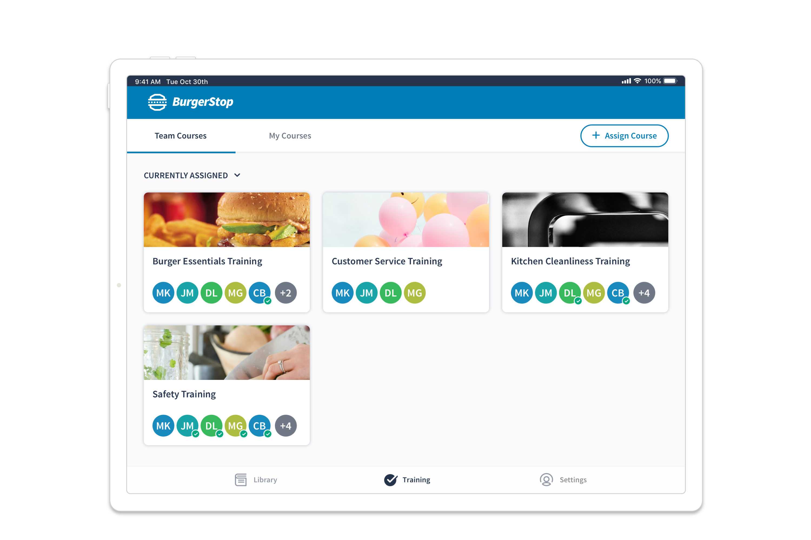

<a href="#final-p4" class="btn-jump">Jump to final designs</a>

## Background

Learning Pathways was a new product line that Inkling began developing in 2018 to sit alongside its existing core product, the Knowledge Library. The Learning Pathways project specifically aimed to support and improve the training experience in retail and restaurant organizations with guided learning paths for new employees. 

This project was divided into three major feature areas that aligned with user persona needs:

1. Enable **HQ Authors** to easily create and distribute trainings to the field. 
2. Provide **New Hires (learners)** with an intuitive and robust training experience.
3. Allow **Field Managers** to oversee and track their employees’ learning progress.

I was the lead designer for the **Field Manager experience** and a collaborating designer on the extended Learning Pathways product. This case study will focus on the manager experience. 

## Research

Our research and work with restaurant and retail companies led us to the following insights and product recommendations:

- The General Manager is usually responsible for the hiring and onboarding of new employees. 
**Product recommendation:** It became a priority to enable the assignment of trainings to happen in the field at the managers discretion, so they could control what courses a new employee received and in when. 

- GMs may be responsible for multiple locations and will not always be available in person. 
**Product recommendation:** A robust mobile experience was essential to a manager overseeing and traveling between multiple locations.

- “Trainers” are frequently other staff members, who may have just started a few weeks prior. (Additionally, a new employee’s trainer may change from day to day.) 
**Product recommendation:** Introduce the concept of a “Supervisor” into the system that can be set at the discretion of the manager, allowing that supervisor to oversee the progress of their trainee. 

- Today’s on-the-job training tracking is almost all paper-based and there is a widespread concern regarding the practice of trainers “pencil whipping” sign-off forms — filling paperwork in after the fact during quality control visits. 
**Product takeaway:** Having real time tracking and easy insight into team progress would be  a high value-add for managers.

## Early Designs & Feedback

My goals for the manager experience were to provide the ability to browse available courses and assign them to team members, to see an overview of the trainings in progress, and to view the specific progress or record of a team member on a given course.

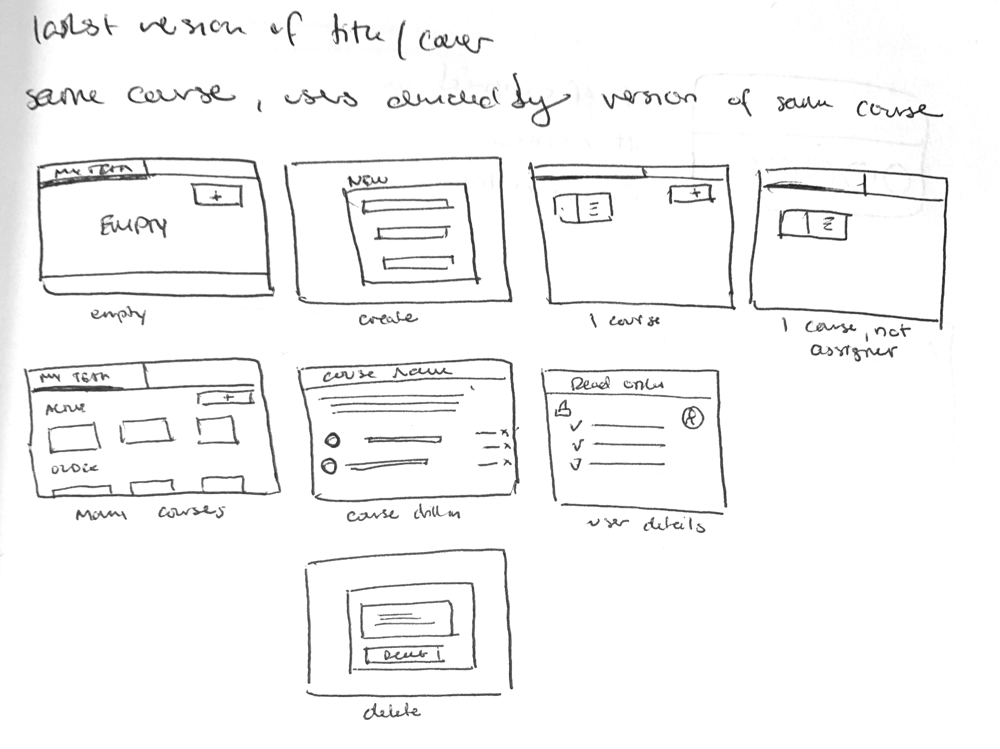

### Manager Dashboard

While our primary product use case was training for new hires, we wanted to accommodate the ability for people in manager roles to potentially take trainings themselves. I therefore chose leave the “Trainee” view of courses as it was, and add a new view for managing courses that would be available for users with “Manager” permissions. I introduced tab navigation in the header to toggle between these two views:  “Teams courses” and “My courses.” 

At this point we had yet to introduce a robust person/profile object into our app, so the dashboard was organized by courses rather than by team member. I therefore proposed to include trainee avatars on each course card so active learners could be seen at a glance. 

")

<!-- 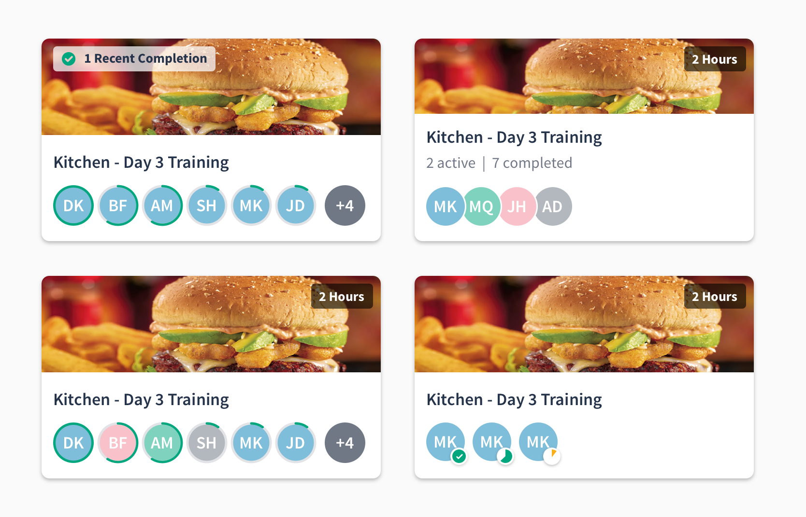 -->

### Course Reports

I next worked on a course report view that displayed a list of team members’ assignments with key progress information that was easily scannable. The list view for tablet and desktop displayed the assignee’s avatar, name and username, their progress on the the course (or completion date), the version of the course they were taking, and the trainer who signed off on their completion. Mobile phone views retained an abbreviated version of this information.

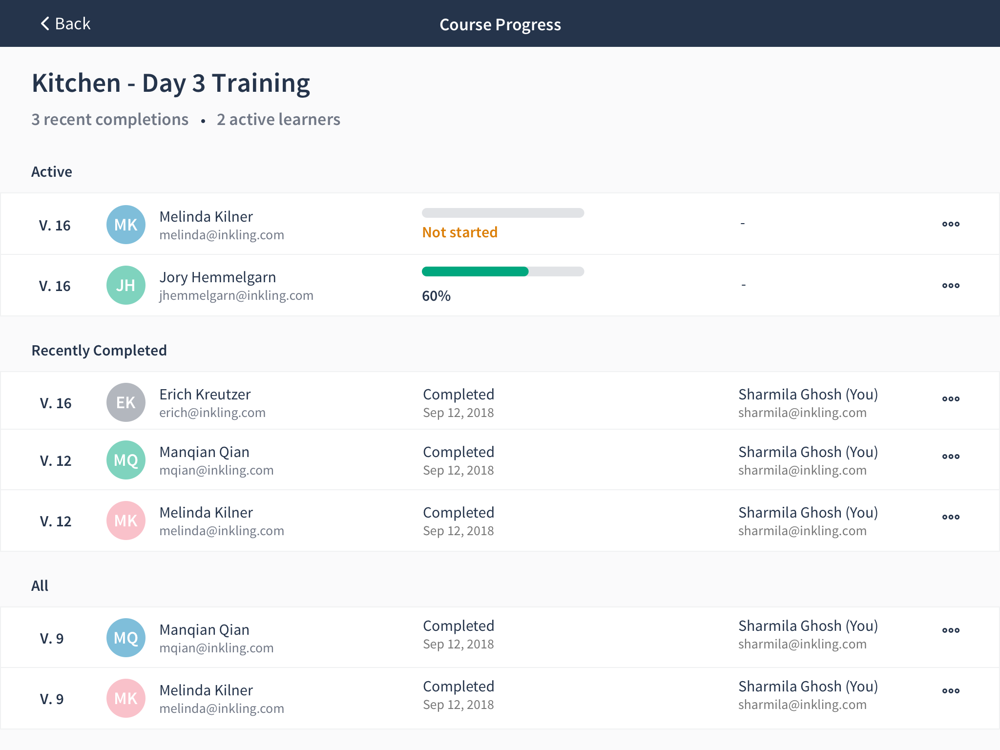

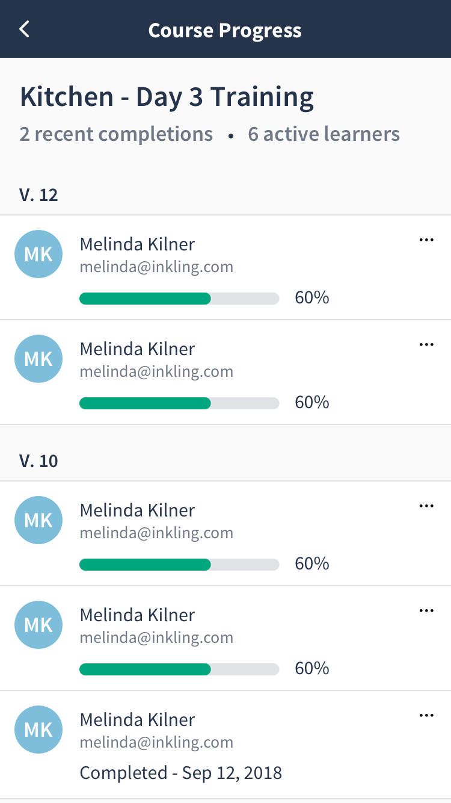

Each assignment linked to a full detail view of the learner’s course record with more granular information on individual step completion and trainer sign-off.

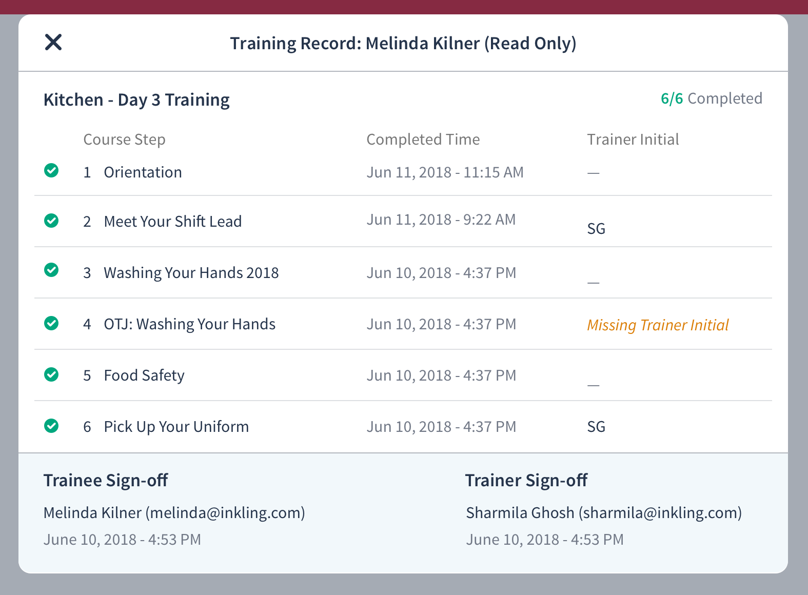

### Course Assignment 

The final piece of the puzzle was to provide managers with a way to assign a course. This required three different steps: selecting assignees, selecting courses, and optionally selecting supervisors.

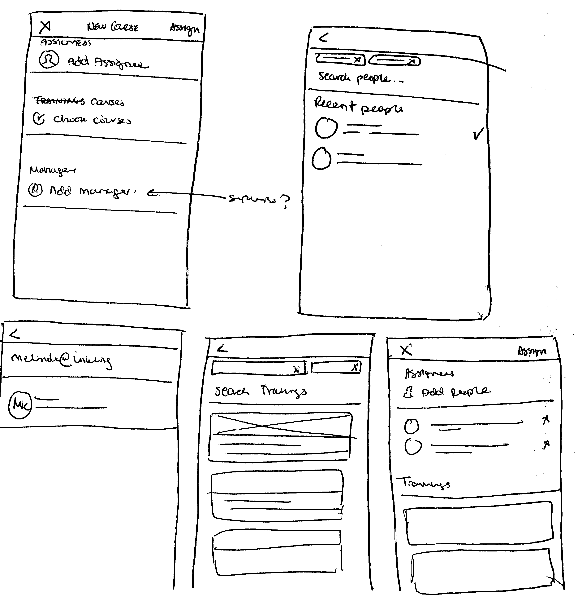

Each step included search and allowed for multiple selections, and all of which could be reviewed and modified on the initial screen before sending out the assignments. 

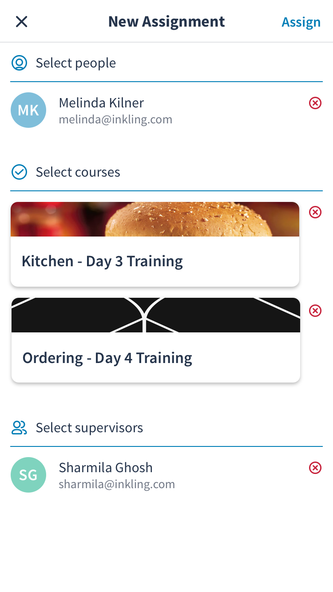

Including the ability to select multiple courses or assign to multiple people when creating assignments was an important criteria for reducing the admin burden on the field manager. It was a common scenario that a manager might want to assign a new employee many courses all up front when they started, or that a new training (such as a Limited Time Offer) might be rolled out to an entire team at once. 

## User Testing and Design Iteration

Our user testing included internal experience testing, remote sessions with existing customers, and formal in-person testing scenarios with external participants to mimic the restaurant environment when using the software.

Some insights and changes I made to the manager experience:

1. In our initial release, managers would have access to the entire organization user list when looking up assignees. To avoid the potential security risk of surfacing this list of users, a manager was required to enter an exact username to find an employee in the system. While we anticipated this would be a pain point in the short term, testing showed us that this was a significantly more problematic experience than we suspected. 
**Design change:**
    - Introduce a more prominent search button and helper text to better guide users
    - Surface a list of recently assigned users when selecting assignees
    - Spin up a project to tackle the creation teams
2. The recent completion information on the course cards didn’t mean much to people (or meant very different things to different users). 
    **Design change:** Opt to remove this entirely and simplify the view
3. People generally grocked the “Team Courses” vs “My Courses” distinction, but were confused by “Active” vs “All” courses in the manager view. In general, users expected to see a library of all courses from which they could create assignments.
4. People anticipated more actions would be available in the individual learner records. 
    **Design change:** Expand and add more detail to this view; begin design exploration on enabling additional actions such as manager sign-off.

<h2 id="final-p4">Final Designs</h2>

### Goals
Enable field managers to:
1. Assign existing courses to their team members
2. See an overview of active trainings on the team
3. Access individual team member training records

The final product was supported across our iOS and Android phone and tablet apps, desktop web, and mobile web.

### Manager Dashboard

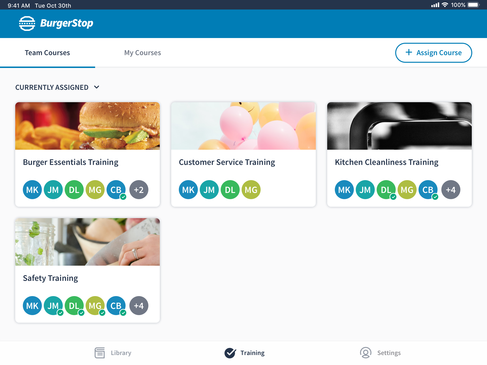

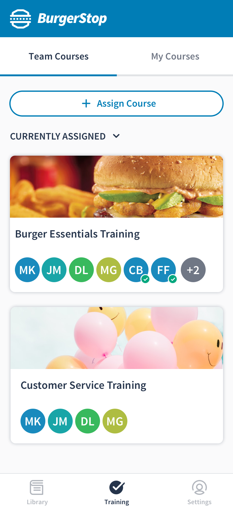

The final dashboard included a tab navigation bar for mangers to move between team course reports and their own courses, featured a prominent assignment button, and included the ability to filter courses by those with current assignments.

### Course Report & User records

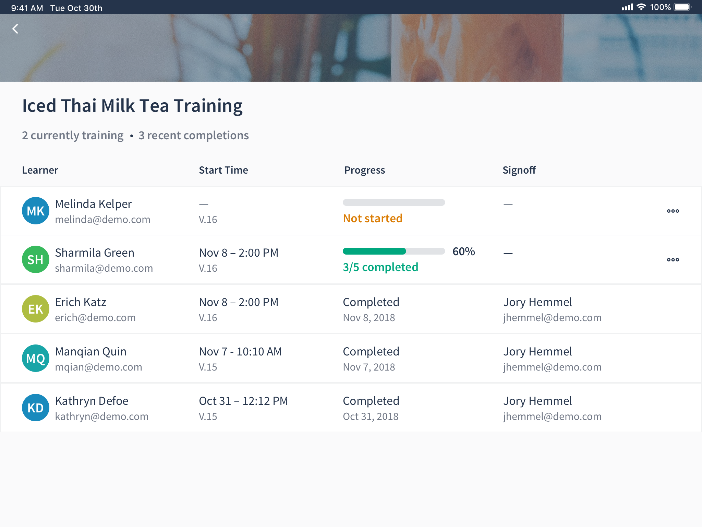

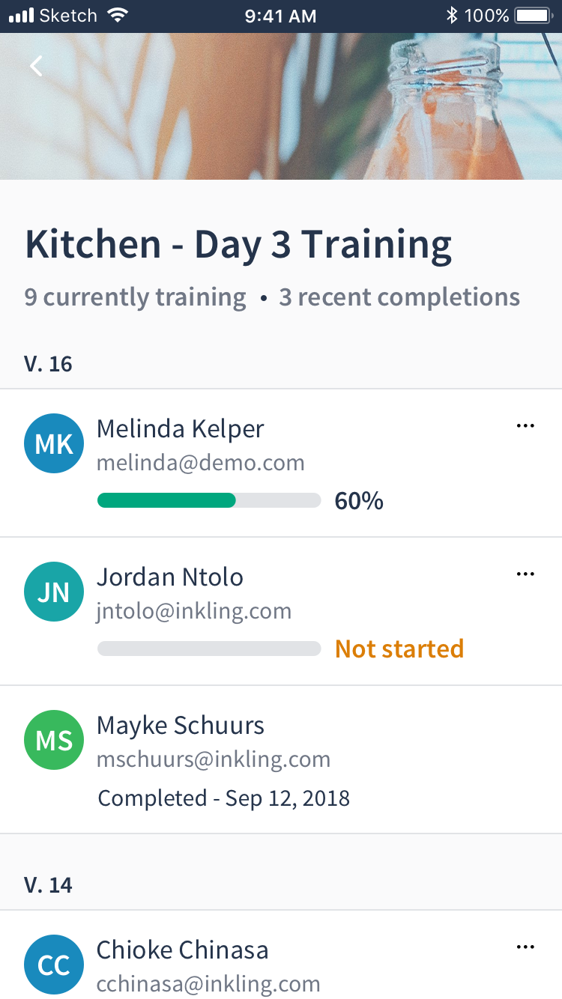

The course reports were updated to include a start time for each assignment to give managers an understanding of how long an employee had been taking a training. The list was ordered by activity to allow a quick scan of employee progress and surface any outliers that might need assistance.

The final design also introduced the ability to delete a non-completed course as a way for a manager to clear assignments that may have been made in error, or that were self-assigned as a way to preview the course content.

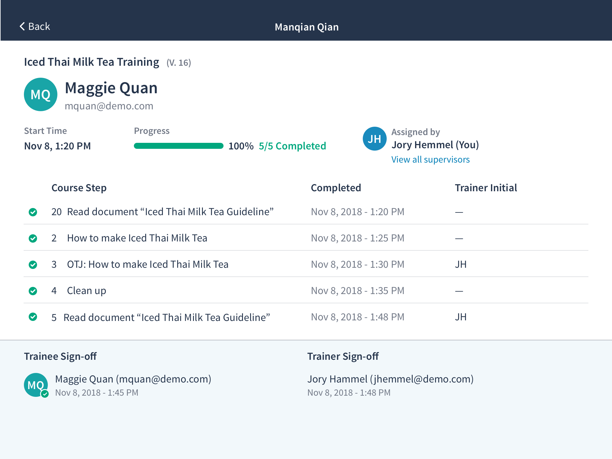

I revised the individual records to be a full screen experience to for future content and functionality in this space. The updated design for the initial release featured the trainee profile more prominently, displayed who assigned the course, and provided a link to view any additional supervisors.

### Course Assignment

The final course assignment flow included a visual refresh and a number of adjustments to enhance usability, such as reordering the steps (choosing courses first), adding more prominent and reachable buttons for search and assignment, and adding checkboxes as a better affordance indicator for multi-selection/de-selection. These enhancements added up to a more expected and understandable experience for first-time users going through the flow. 

Assignee selection included a new list of not only recently assigned, but recently searched users to alleviate the pain of managers from needing to perform an exact search for a user multiple times. This “recent” list synced across a user's account.

The assignment experience was similar across native apps and mobile web. However, I was able to create a custom design for desktop web. This larger-screen experience allowed for a single view navigation between each step, rather than needing to move back and forth between these two views. 

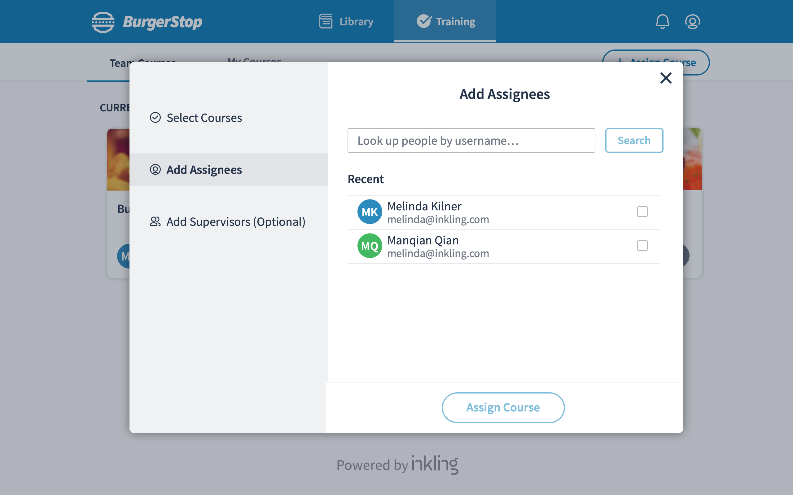

## Next Steps

We released a Beta version of Learning Pathways to 5 customers in March of 2019 and have been collecting regular feedback from course authors and training managers to inform feature improvements across the product. 

