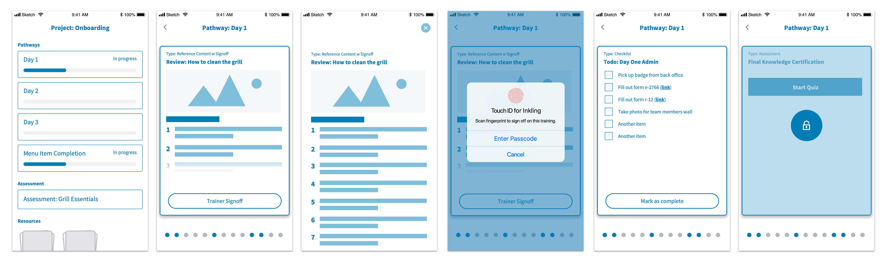
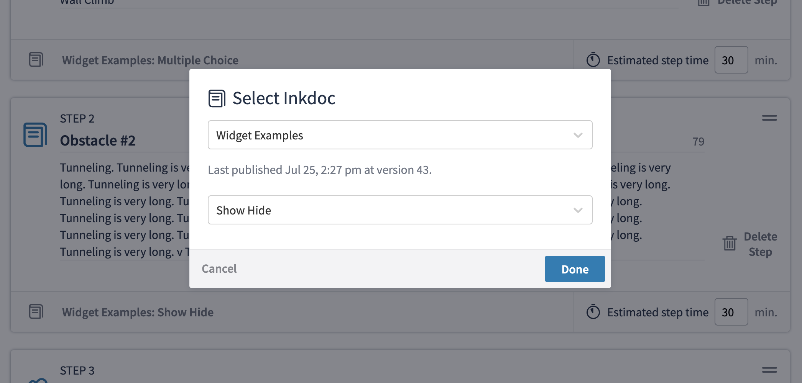
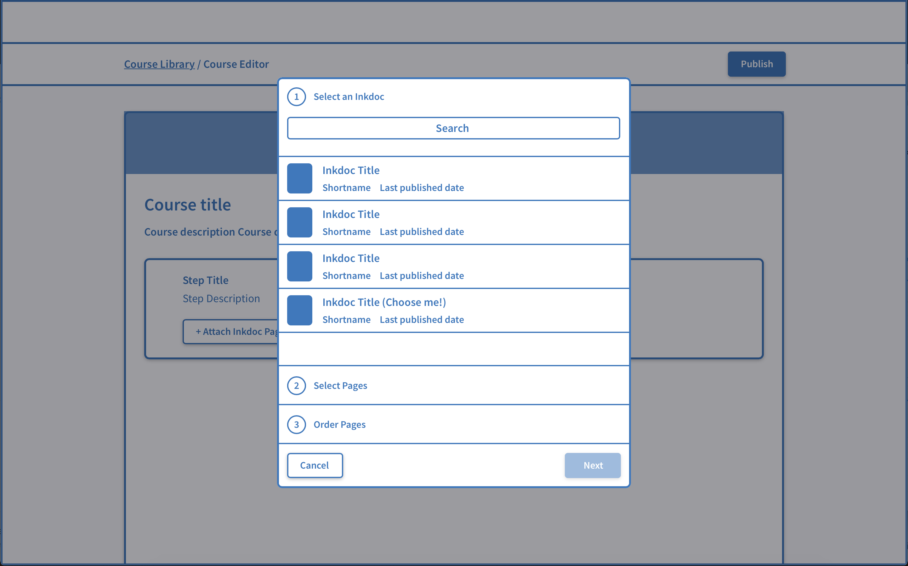
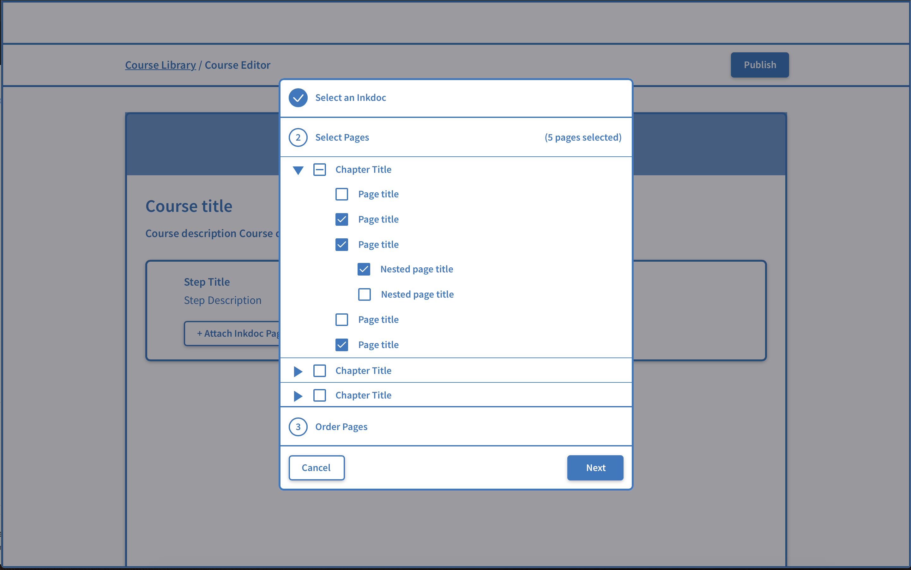
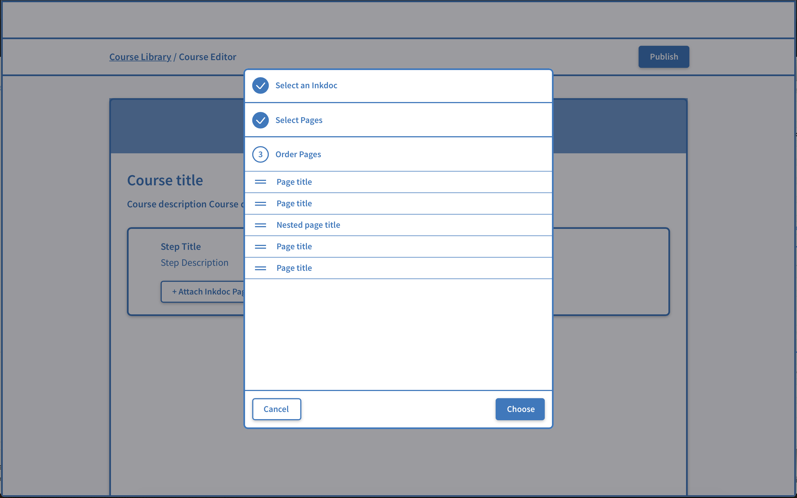

## Training Path Deck 

A concept prototype to help illustrate how we might provide a learning experience within the flow of work for onboarding deskless workers. The card-based approach provides a lightweight way for a new restaurant employee to go through a sequence of learning content, getting sign-off from their trainer directly in context.

 

## Multi-Page Selection

### The Problem

In creating a new Inkling course, authors had the option to link an existing page of Inkling content to a step. The first iteration of course authoring allowed only a single page to be selected, via a UI where a user first selected a the book (Inkdoc), then selected the page.

We found authors frequently wanted to add multiple pages or entire chapters to a step for training, rather than link each individual page as step. We therefore began an exploration into supporting multiple pages of content beginning with the selection experience.

### Support Multiple Pages (Version #1)

A UX spike for this feature led to the following recommendation:

- If limiting page selection to a single document, maintain a step-by-step flow of first choosing a document, then selecting multiple pages from it.
- Because some customers were interested in embedding a whole chapter, create a page selection UI that leverages the existing book structure, allowing for the selection of pages by chapter
- Allow for the ordering of pages as a final step. This ensures course authors are not limited by the existing architecture of the document, and facilitates mental separation between course pages and Inkdocs.
- Continue to use a modal experience to support the use of launch of component in other parts of the app. 

### Support Multiple Pages (Version #2)

After the initial exploration, it turned out that a separate stream of engineering work would enable us to bundle pages from **multiple** Inkdocs fairly easily. I therefore went back to the drawing board to see how we might enable selection of pages across multiple documents without losing the benefit of the initial 'selection by chapter' UI or creating a tedious selection process if you were looking for a single page.

The final proposal involved:
- A global search that surfaced both pages and documents
- A separate flow for documents that continued to allow for chapter-based selection
- A shopping cart-like experience that enabled the user to view their selections at any point in the process and remove or reorder them.

<!-- 

## Course Authoring Redesign -->

