

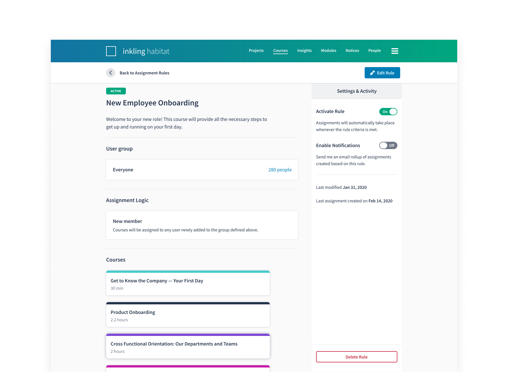

<a href="#final-p6" class="btn-jump">Jump to final designs</a>

## Background

When Inkling Learning Pathways initially launched, managers in the field had the ability to manually assign courses to their team members for the purposes of onboarding and training. While this distributed system enabled teams to use the product right off the bat, it placed a heavy burden on managers and admins, and did not scale for large organizations needing to train hundreds or thousands of employees. 

The goal of this project was to provide organizations with a smart way to assign and manage courses at scale, alleviate the admin burden of assigning trainings, and ensure the right people had access to the right courses in a timely manner. 

## Research & Concept Testing

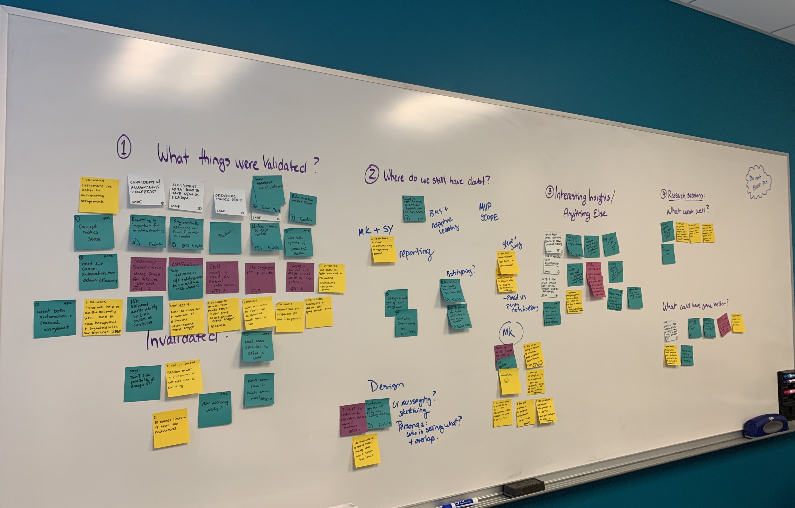

Our research with customers helped us validate the overall need and usefulness of an automated assignment feature, where courses would be assigned based on a predefined set of criteria and initiating event.

* The most common event people wanted to initiate an assignment was a new employee joining the organization. They would need general onboarding training in addition to training specific to their role. Participants also described the desire for a group-change event, where an employee would receive specific training if they changed location or job role. 

* Also mentioned frequently were date-based assignments for the purpose of training events or recurring certifications.

* Additional use-cases included assignments based on assessment scores and a staggered rollout of onboarding courses over a period of time.

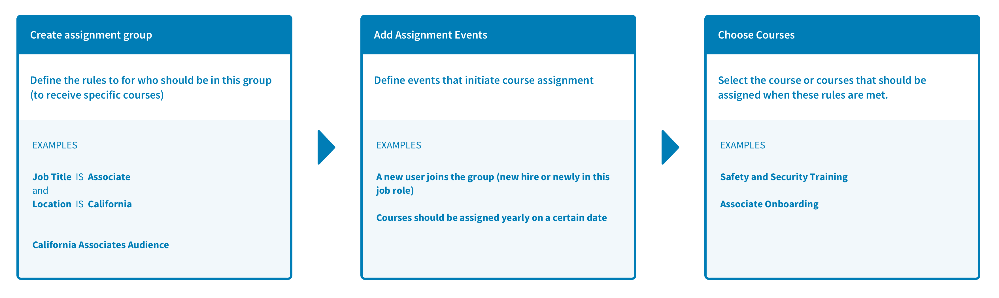

## Early Designs

The early wireframes below built out the idea of an organization-level space to view and manage rules for automating the assignment of courses to employees. They also explored ways to display the assignment activity and progress within the admin experience. 

<!-- 

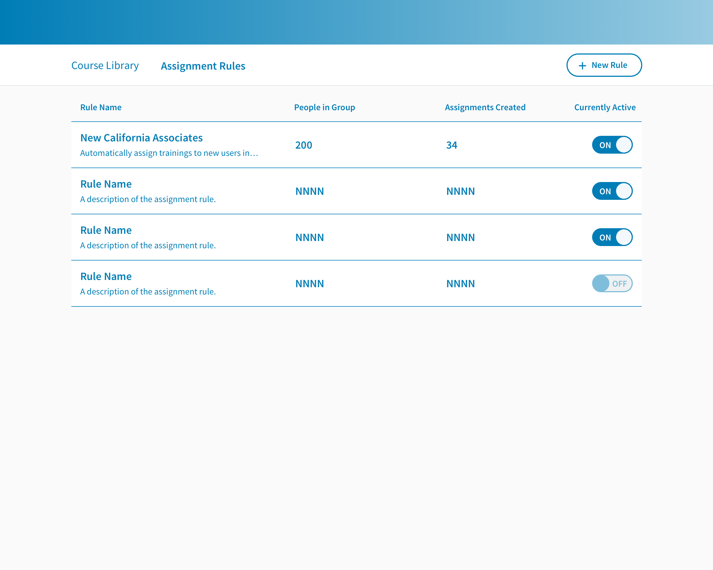

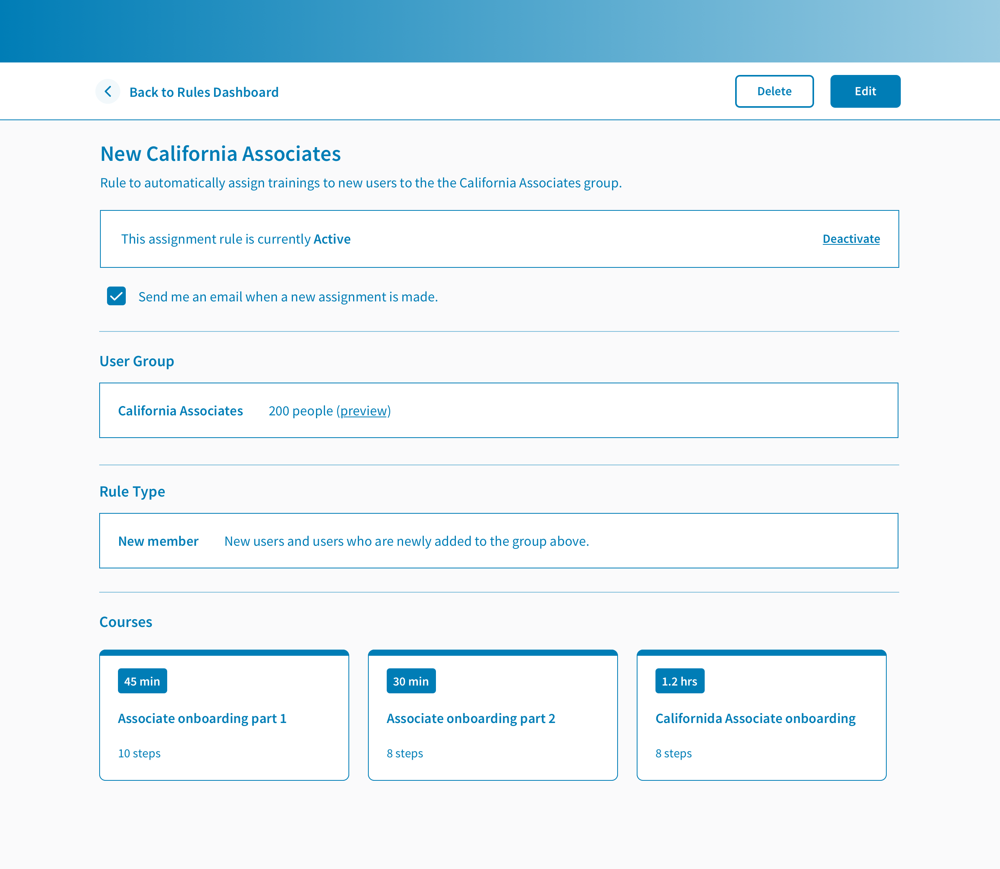

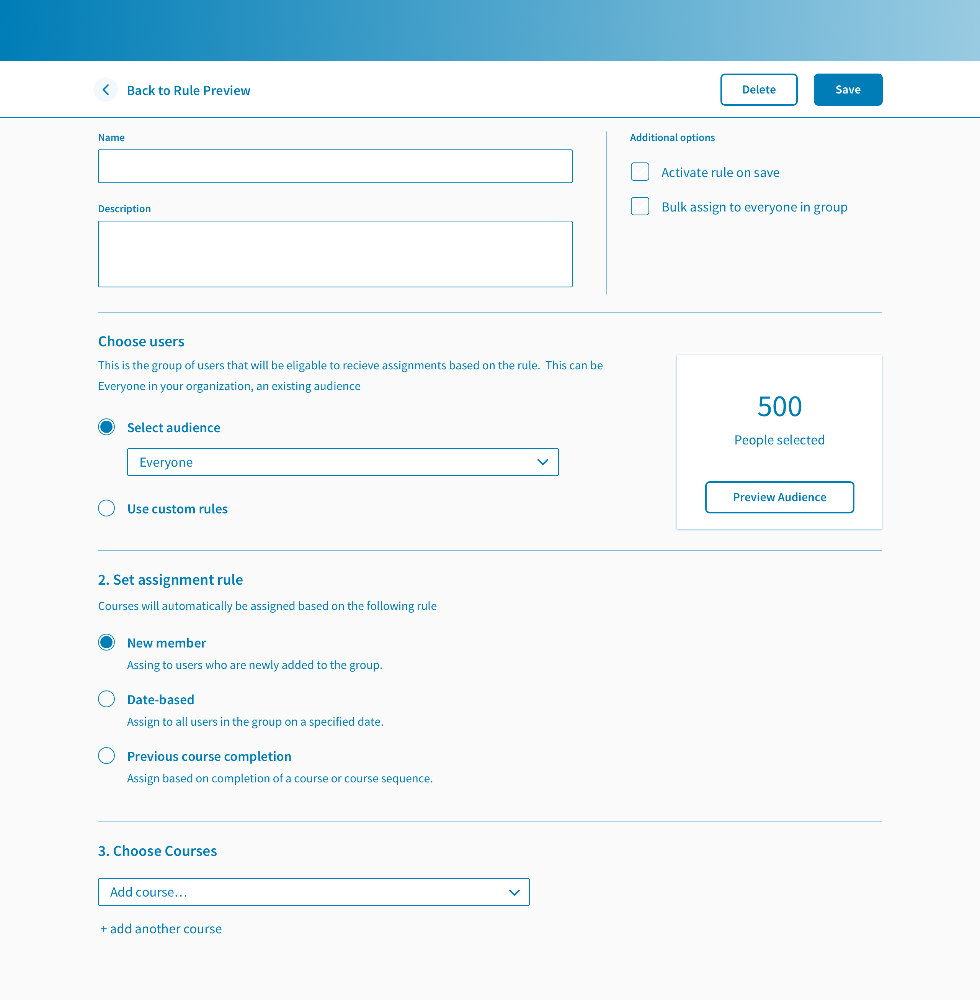

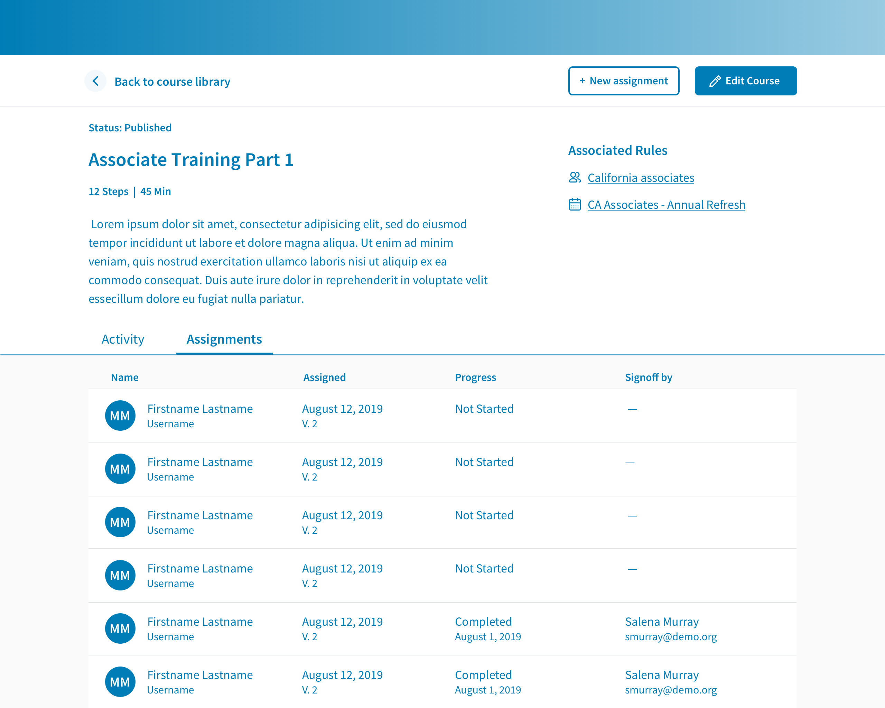

 -->

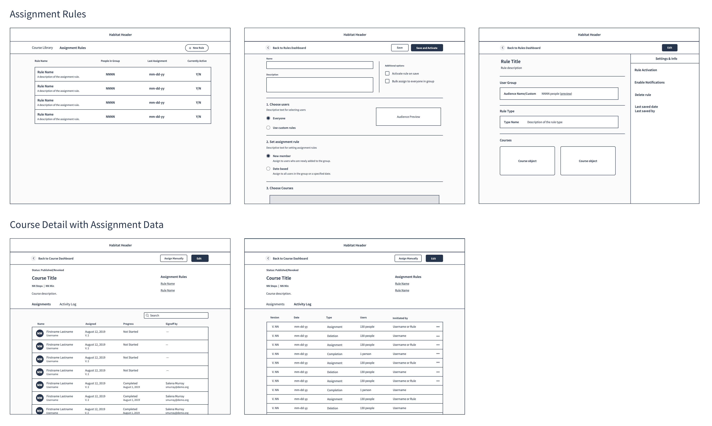

As part of this project we also dug into the need to be able to provide sequences and/or gate courses so they had to be completed in a particular order. Our long-term strategy was to enable authors to build reusable curriculum objects that could also be assigned in the field, and would have a corresponding object on learner side. In the interim, we explored ways to provide some of this functionality in a lighter-weight way that would get our customers seeing that value sooner.

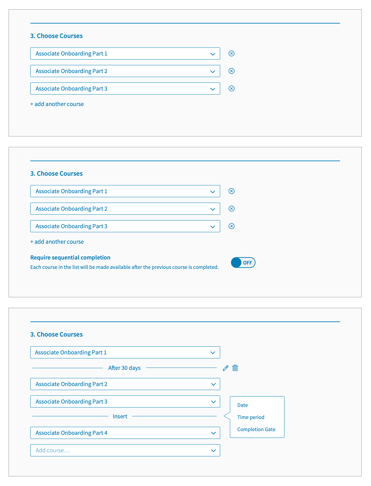

## User Testing

By the time we began usability testing we were under full stay-at-home orders due to Covid19 and all sessions had to be conducted remotely. We were able to leverage Figma during this time to send our test subjects direct URL prototypes and follow along as they went through various interactions. 

We were pleased to see all users successfully complete the tasks set out of them, and were able to identify key areas to improve the UX around the assignment logic selection, navigating to assignment records, and the removal of assignments.

## Technical Design

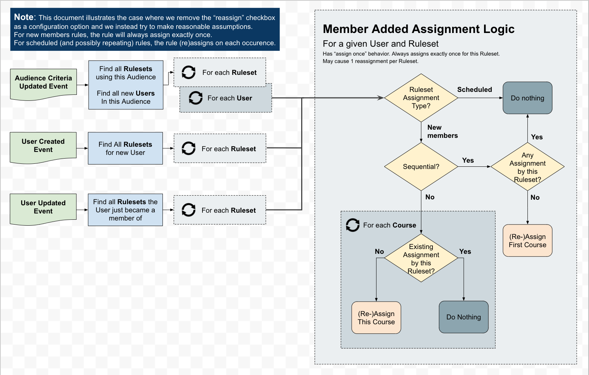

This project presented some meaty technical challenges, particularly due to the fact that course sequences could be edited at any point. At the core we found ourselves with two paths, each with different ramifications: a versioned course sequence object that was fixed once assigned, or a live updating set of rules.

Though not the norm in learning management industry, we ultimately chose the path of a live updating object as better addressing the intensions of a sequenced pathway that was changed.

<h2 id="final-p6">Final designs</h2>

The final designs introduced a new tab to the Courses space where admins can view, create, and modify the assignment rules for their organization. It also included a new course detail where assignment activity could be reviewed. 

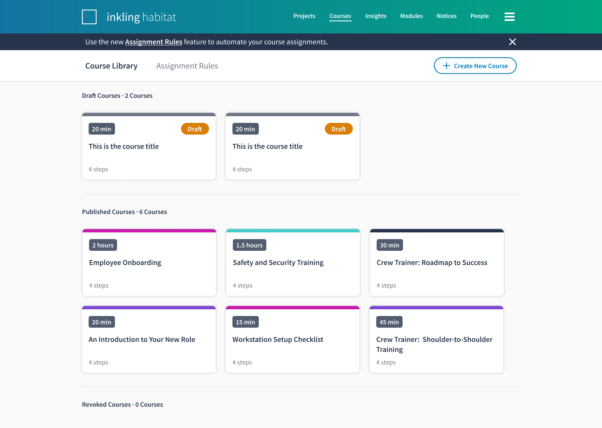

### Rules Dashboard

The rules dashboard provides a searchable list view of all the existing rules, sortable by name, last edited, when the rule last ran, or whether the rule is active or inactive. 

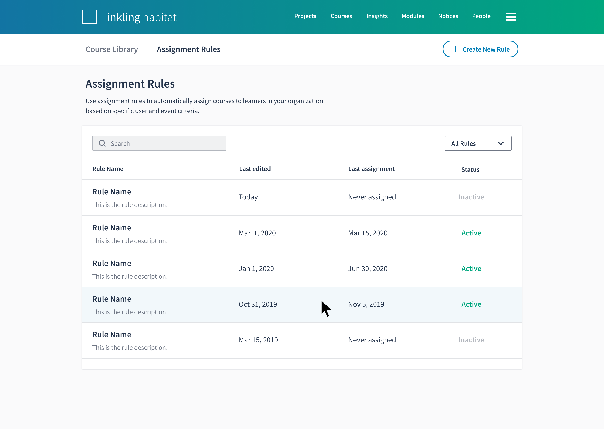

### Rule Builder

The rule builder is where an admin can create and define the behavior of an assignment rule. There are three parts to building a rule:
1. Define the group the rule should apply to by choosing an existing audience or creating a new group.
2. Choose the assignment logic. This can either be a new member joining the group or a scheduled recurring date.
3. Select the courses that should be assigned when the criteria is met, and specify whether the courses should be assigned all at once or sequentially.

Admins can name the rule and provide a brief description, as well as save and/or activate the rule from this view. Once active, assignments will be made in an ongoing basis whenever the rule criteria are met.

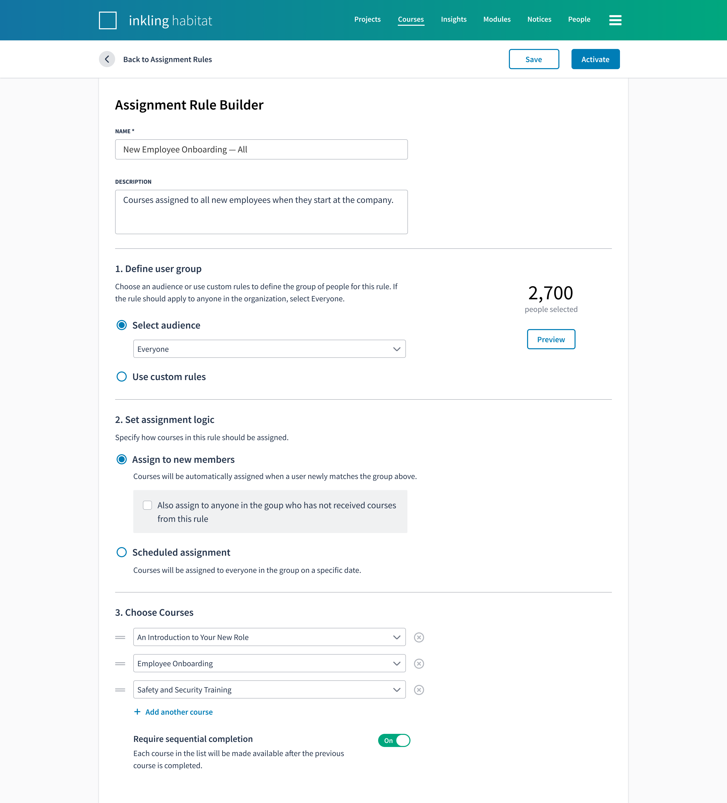

### Rule Detail

A rule detail is created as soon as an admin saves any portion of a rule. This view enables admins to see all of the logic a rule is using including the user group, assignment logic, which courses the rule assigns, and whether or not they are assigned sequentially.

From the Settings & Activity panel, they can also easily activate or deactivate the rule, choose to receive email notifications when the rule runs, see information about when the rule was last edited, and when the last assignment was created. 

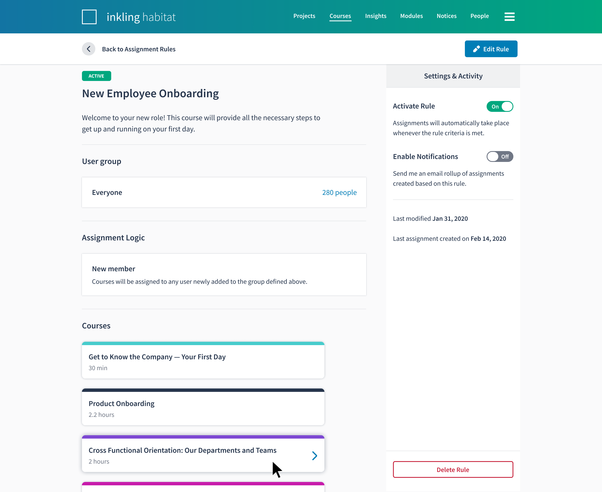

### Course Detail

Either following a link from the rule or navigating through the Course Library, the admin can now access a detail view of the course that displays an activity log of all assignments made by individuals or by automated rules. The full list of assignees in a batch can be reviewed and assignment batches can be rolled back in case of an error. The detail view also features a list of any assignment rules the course is used in for quick reference. 

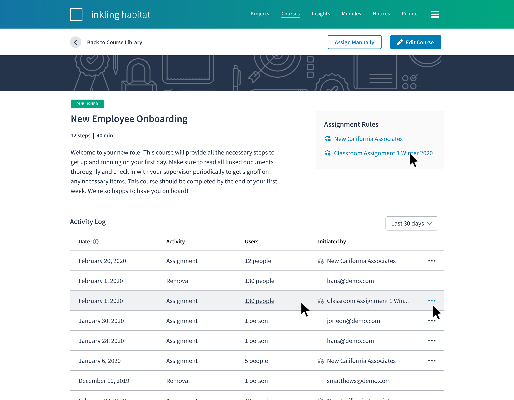

